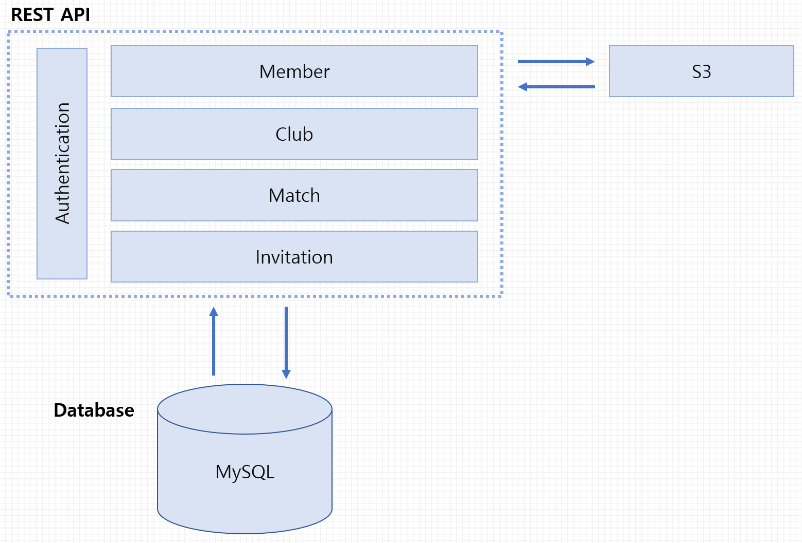
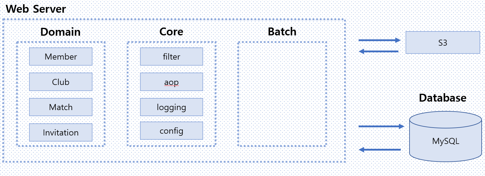
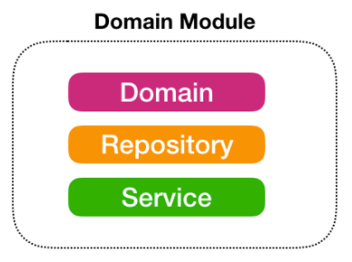

# We Are Player
## 소개
각 지역의 축구 클럽끼리 경기를 진행하도록 도와주는 REST API 서버입니다.

## 현재 진행 상황
### 시스템 구성도

### 구현사항
- 각 도메인(Member, Club, Match, Invitation) 별 crud 구현
- Member, Club 통합, 유닛테스트 구현
- 커스텀한 ErrorCode를 사용한 Exception 구현
- Spring Security와 JWT를 통한 인증, 권한 필터링 기능 구현
- S3를 사용하여 이미지 처리 구현
- Profile 별 yml 설정

## 계획
### 시스템 구성도

### 앞으로 구현할 사항
- 모듈화([참고](https://woowabros.github.io/study/2019/07/01/multi-module.html))
    - 독립 모듈 계층(com.wap.Indepency-available)
        - 독립적으로 실행 가능한 모듈
            - yaml-importer
    - 공통 모듈 계층(com.wap.common)
        - Type, Util, Dto를 저장하는 모듈로써 의존성을 가지지 않는다.
            - enums
    - 도메인 모듈 계층(com.wap.domain)
        - 서비스 비지니스는 모르는 모듈
        - 각 도메인의 CRUD만(통계 이런거 x)을 책임진다.
        - 현 모듈의 서비스에서는 vaildation, transaction 과 같은 로직만을 책임진다.
        
            - com.wap.domain.member
            - com.wap.domain.club
            - com.wap.domain.match
            - com.wap.domain.invitation
    - 내부 모듈 계층(com.wap.core)
        - 시스템의 필요한, 시스템의 전체적인 기능을 서포트하기 위한 모듈
            - com.wap.core.security
            - com.wap.core.aop
            - com.wap.core.s3
            - com.wap.core.logging
            - com.wap.core.config
    - 어플리케이션 모듈 계층(com.wap.api)
        - 최 상단 계층이다.
        - 하위 모듈을 조립하여 비즈니스 로직을 생성한다.
            - com.wap.api.member
            - com.wap.api.club
            - com.wap.api.match
            - com.wap.api.Invitation
- 배치서버 구축
    - 기간이 만료된 Invitation(초대장)을 삭제하는 기능