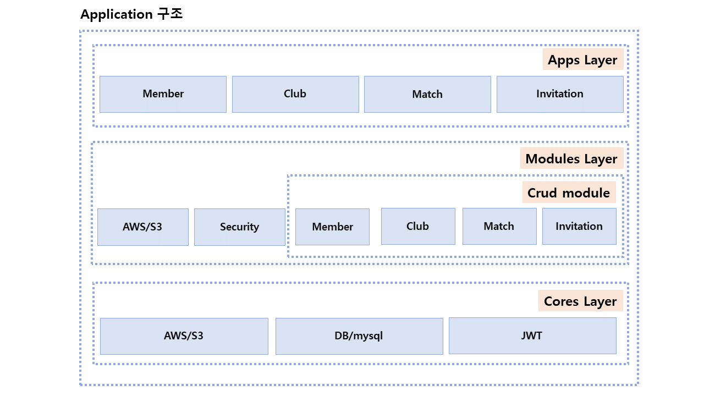

# We Are Player REST API Server
## 소개
각 지역의 축구 클럽끼리 경기를 진행하는데 필요한 서비스를 제공하는 REST API 서버입니다.

---

## 사용기술
- Spring Boot
- Gradle
- Jenkins, Docker
- Spring Security, JWT
- JPA, JDBCTemplate
- MySQL
- AWS, RDS

---

## 시스템 구성도

---

## 성과
- MSA 기반의 멀티모듈을 사용하였습니다.
- jenkins와 docker를 사용한 CI를 구축하였습니다.
- 커스텀한 ErrorCode를 사용한 Exception 구현하였습니다.
- Spring Security와 JWT를 통한 인증, 권한 필터링 기능 구현하였습니다.
- S3를 사용하여 이미지 처리 구현하였습니다.
- Profile 별 yml 설정하였습니다.
- Member, Club 통합, 유닛테스트 구현하였습니다.